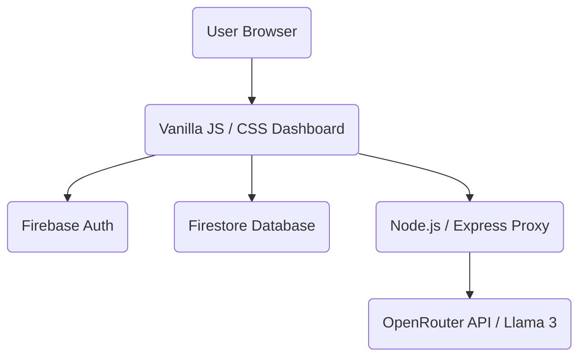

# 🚀 StudyMate AI — Premium AI Study Companion

[](https://github.com/your-username/studymate)
[](https://firebase.google.com/)
[](https://nodejs.org/)
[](https://github.com/your-username/studymate)

StudyMate AI is a cutting-edge, AI-powered study companion designed for students preparing for competitive exams like **UPSC, JEE, and NEET**. It leverages advanced LLMs via OpenRouter to provide structured reasoning, technical solutions, and natural Hinglish support.

---

## ✨ Features

- **🎯 Specialized Study Modes**: Context-aware AI tutoring for UPSC (Deep Analysis), JEE (Step-by-Step Solving), and NEET (Biology Focus).
- **📝 Intelligent Notes Generation**: Instantly transform queries into Bullet Points, Structured Revision Notes, or Flashcards.
- **🗣️ Native Hinglish Support**: Balanced bilingual responses (Hindi + English) for conceptual clarity that feels natural.
- **📊 Performance Tracking**: Built-in Study Tracker with daily question counters and activity streaks.
- **🔒 Secure Custom Auth**: Fully custom Firebase authentication flow with intercepted action handlers for a white-labeled experience.
- **🎨 Elite UI/UX**: Dark-themed, glassmorphic dashboard with smooth animations and responsive design.

---

## 🏗️ Architecture



### Key Technical highlights
- **AI Fallback System**: Automatic multi-model fallback (DeepSeek, Mistral, Qwen) to ensure 99.9% AI availability.
- **Secure Proxy**: Backend proxy architecture to keep sensitive API keys safe from the client side.
- **Audit-Ready History**: Append-only message architecture to maintain conversation integrity.

---

## 🚀 Quick Start

### 1. Backend Setup
1. Navigate to the `server` directory:
   ```bash
   cd server
   npm install
   ```
2. Create your `.env` file:
   ```bash
   cp .env.example .env
   ```
3. Add your [OpenRouter API Key](https://openrouter.ai/keys) to the `.env` file.
4. Start the proxy:
   ```bash
   npm start
   ```

### 2. Frontend Setup
1. Update `firebase.js` with your Firebase project credentials.
2. Initialize your Firestore database with the required rules (see Security section).
3. Serve the application:
   ```bash
   # Using serve (recommended)
   npx serve .
   ```

---

## 🔒 Security & Privacy

- **Action Interceptor**: Custom `action-handler.html` completely bypasses the default Firebase UI for password resets and email verifications.
- **Data Isolation**: Firestore Security Rules ensure users can only access their own study history and tracker data.
- **Zero-Key Exposure**: All LLM requests are proxied via the Node.js backend.

---

## 🛠️ Technology Stack

- **Core**: Vanilla HTML5, CSS3 (Modern Flex/Grid), JavaScript (ESM).
- **Cloud**: Firebase Firestore & Firebase Authentication.
- **Intelligence**: OpenRouter API Integration.
- **Runtime**: Node.js & Express.js.

---

## 📄 License

Distributed under the MIT License. See `LICENSE` for more information.

---

<p align="center">Made with ❤️ for Students</p>
