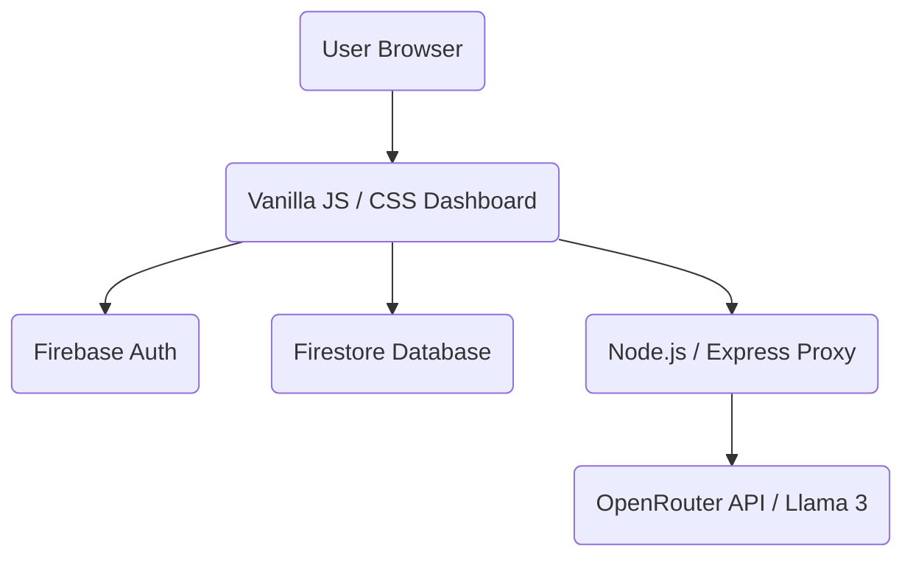

# 🚀 StudyMate AI — Your Personal AI Study Assistant

[](https://firebase.google.com/)
[](https://nodejs.org/)
[](https://expressjs.com/)
[](https://developer.mozilla.org/en-US/docs/Web/JavaScript)

StudyMate AI is a cutting-edge, AI-powered study companion designed for students preparing for competitive exams like **UPSC, JEE, and NEET**. It transforms complex topics into simple, actionable study materials using advanced LLMs via OpenRouter.

---

## ✨ Features

- **🎯 Specialized Study Modes**: Tailored assistance for UPSC, JEE, NEET, and General studies.
- **📝 Intelligent Notes Generation**: Instantly generate Bullet Points, Revision Notes, or Flashcards.
- **🗣️ Hinglish Support**: Natural bilingual responses (Hindi + English) for better conceptual clarity.
- **📊 Study Tracker**: Monitor your progress with a daily question counter and activity streaks.
- **🔒 Secure & Private**: Per-user data isolation with Firebase Authentication and Firestore Security Rules.
- **💬 Append-Only Chat History**: Robust subcollection-based storage to preserve conversation integrity.
- **🎨 Premium UI/UX**: Dark-themed, glassmorphic design inspired by modern AI interfaces.

---

## 🏗️ Architecture



---

## 🚀 Getting Started

### 1. Prerequisites
- Node.js (v18+)
- A Firebase Project
- An OpenRouter API Key

### 2. Backend Setup
```bash
cd server
npm install
```
Create a `.env` file in the `server` directory:
```env
PORT=3001
OPENROUTER_API_KEY=your_openrouter_key
```
Run the server:
```bash
npm start
```

### 3. Frontend Setup
Update `firebase.js` in the root directory with your Firebase configuration:
```javascript
const firebaseConfig = {
  apiKey: "YOUR_API_KEY",
  authDomain: "YOUR_AUTH_DOMAIN",
  projectId: "YOUR_PROJECT_ID",
  // ...
};
```
Serve the root directory using any local server (e.g., Live Server or `serve`):
```bash
npx serve .
```

---

## 🔒 Security

- **Append-Only History**: Messages cannot be deleted or modified by users once sent, creating a reliable audit trail.
- **Server-Side Timestamps**: All database writes use `serverTimestamp()` to ensure authoritative data.
- **Auth Guards**: Automatic redirection to login for unauthenticated sessions and `no-cache` headers for protected pages.

---

## 🛠️ Technology Stack

- **Frontend**: Vanilla HTML5, CSS3 (Modern Flex/Grid), JavaScript (ESM).
- **Backend**: Node.js, Express.js.
- **Database/Auth**: Firebase Firestore & Auth.
- **AI Integration**: OpenRouter API (Llama-3-8B).

---

## 📄 License

Distributed under the MIT License. See `LICENSE` for more information.

---

<p align="center">Made with ❤️ for Students</p>
